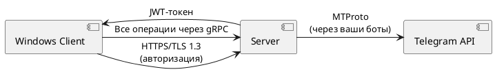

# 🚀 TeleChannel Manager - Windows Client

**Управляйте Telegram-каналами как профессионал через безопасное Windows-приложение.**

[GitHub release](#) | [GitHub license](#)

---

## 🌟 Цель проекта

Создать надёжное, безопасное и удобное Windows-приложение для управления Telegram-каналами с использованием собственного сервера, поддерживающего аутентификацию, планирование публикаций и аналитику.

---

## 🧩 Основной функционал

| Функция            | Описание |
|--------------------|----------|
| 🔐 **Безопасное хранение** | Все ключи ботов шифруются по стандарту AES-256 и хранятся только на вашем сервере |
| 📢 **Умная публикация** | Планирование постов, Rich-текст, медиавложения, шаблоны контента |
| 🛡️ **Модерация** | Автоматическое удаление комментариев, бан-листы, антиспам |
| 📊 **Аналитика** | Просмотр статистики в реальном времени, экспорт в Excel/PDF |
| 🤖 **Бот-менеджер** | Централизованное управление подключениями ботов с правами доступа |

---

## 🛠 Архитектура


```plantuml
@startuml

[Windows Client] -> [Server]: HTTPS/TLS 1.3\n(авторизация)
[Windows Client] <- [Server]: JWT-токен
[Server] -> [Telegram API]: MTProto\n(через ваши боты)
[Windows Client] -> [Server]: Все операции через gRPC

@enduml
```

---

## 👥 Команда проекта

| Участник | Вклад |
|----------|-------|
| **Ильин Владимир** | Разработка клиента: оконный интерфейс, клиент в синглтоне, готовый клиент |
| **Сергеев Никита** | Серверная часть: обработка запросов, база данных, регистрация, авторизация |
| **Парамонычева Анастасия** | Wiki-документация, описание репозитория, структура Git |
| **Кодзаев Николай** | Docker, Doxygen, автоматизация документации |

---

## ⚙️ Установка и запуск

1. **Склонируйте репозиторий:**
   ```bash
   git clone https://github.com/your-org/telechannel-manager.git
   cd telechannel-manager
   ```

2. **Соберите контейнеры Docker:**
   ```bash
   docker-compose up --build
   ```

3. **Сборка и запуск клиента:**
   - Откройте проект в Visual Studio
   - Настройте `app.config` для указания IP сервера
   - Запустите в режиме Debug

---

## 🧪 Тестирование

- **Функциональные тесты:** Проводятся по чек-листам и сценариям, оформлены в `.xls`
- **Unit-тесты:** Охватывают серверные модули и основные методы
- **Тест-план и стратегия:** Прописаны в Excel, включают план, чек-листы и дефекты

---

## 📚 Документация

- **Doxygen:** Автоматическая генерация документации из кода (`/docs`)
- **Диаграммы:** Use Case, диаграммы классов, структурная схема архитектуры
- **User Guide:** Подробная инструкция пользователя доступна в разделе Releases

---

## 💡 Как внести вклад

1. Сделайте форк репозитория
2. Создайте ветку `feature/your-feature`
3. Протестируйте изменения
4. Отправьте pull request
5. Обязательно обновите документацию при изменении функционала

---

## 📁 Структура проекта

- `/client` — Windows-клиент (WPF)
- `/server` — Сервер (gRPC + PostgreSQL)
- `/docker` — Docker-конфигурации
- `/docs` — Doxygen и UML
- `/tests` — Unit и функциональные тесты

---

## 🔒 Безопасность

- Шифрование токенов и ключей — AES-256
- JWT-аутентификация
- Все данные передаются через TLS 1.3
