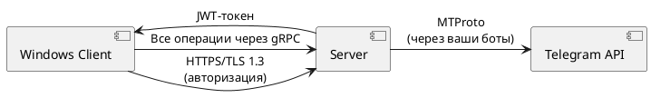

# 🚀 TeleChannel Manager - Windows Client

**Управляйте Telegram-каналами как профессионал через безопасное Windows-приложение.**

[GitHub release](#) | [GitHub license](#)

---

## 🌟 Цель проекта

Создать надёжное, безопасное и удобное Windows-приложение для управления Telegram-каналами с использованием собственного сервера, поддерживающего аутентификацию, планирование публикаций и аналитику.

---

## 🧩 Основной функционал

| Функция            | Описание |
|--------------------|----------|
| 🔐 **Безопасное хранение** | Все ключи ботов шифруются по стандарту AES-256 и хранятся только на вашем сервере |
| 📢 **Умная публикация** | Планирование постов, Rich-текст, медиавложения, шаблоны контента |
| 🛡️ **Модерация** | Автоматическое удаление комментариев, бан-листы, антиспам |
| 📊 **Аналитика** | Просмотр статистики в реальном времени, экспорт в Excel/PDF |
| 🤖 **Бот-менеджер** | Централизованное управление подключениями ботов с правами доступа |

---

## 🛠 Архитектура



---

## 👥 Команда проекта

| Участник | Вклад |
|----------|-------|
| **Ильин Владимир** | Разработка клиента: оконный интерфейс, клиент в синглтоне, готовый клиент |
| **Сергеев Никита** | Серверная часть: обработка запросов, база данных, регистрация, авторизация |
| **Парамонычева Анастасия** | Wiki-документация, описание репозитория, структура Git |
| **Кодзаев Николай** | Docker, Doxygen, автоматизация документации |

---

## ⚙️ Установка и запуск

1. **Склонируйте репозиторий:**
   ```bash
   git clone https://github.com/your-org/telechannel-manager.git
   cd telechannel-manager
   ```

2. **Соберите контейнеры Docker:**
   ```bash
   docker-compose up --build
   ```

3. **Сборка и запуск клиента:**
   - Откройте проект в Visual Studio
   - Настройте `app.config` для указания IP сервера
   - Запустите в режиме Debug

---

## 🧪 Тестирование

- **Функциональные тесты:** Проводятся по чек-листам и сценариям, оформлены в `.xls`
- **Unit-тесты:** Охватывают серверные модули и основные методы
- **Тест-план и стратегия:** Прописаны в Excel, включают план, чек-листы и дефекты

---

## 📚 Документация

- **Doxygen:** Автоматическая генерация документации из кода (`/docs`)
- **Диаграммы:** Use Case, диаграммы классов, структурная схема архитектуры
- **User Guide:** Подробная инструкция пользователя доступна в разделе Releases

---

## 💡 Как внести вклад

1. Сделайте форк репозитория
2. Создайте ветку `feature/your-feature`
3. Протестируйте изменения
4. Отправьте pull request
5. Обязательно обновите документацию при изменении функционала

---

## 📁 Структура проекта

- `/client` — Windows-клиент (WPF)
- `/server` — Сервер (gRPC + PostgreSQL)
- `/docker` — Docker-конфигурации
- `/docs` — Doxygen и UML
- `/tests` — Unit и функциональные тесты

---

## 🔒 Безопасность

- Шифрование токенов и ключей — AES-256
- JWT-аутентификация
- Все данные передаются через TLS 1.3

---

## 📈 Этапы разработки

Разработка проекта велась по этапам, соответствующим основным компонентам и задачам. Ниже приведено пошаговое описание:

---

### 1. 🧱 Подготовка и инициализация репозитория

- Создана структура Git-репозитория: ветки `main`, `client`, `server`, `docs`.
- Добавлены описание проекта, логотип, структура README.
- Ответственный: **Парамонычева Анастасия**

---

### 2. ⚙️ Серверная часть

- Разработка сервера на базе gRPC:
  - Обработка входящих запросов (парсинг + заглушки)
  - Создание архитектуры с шаблонами под будущие функции
- Реализация подключения к базе данных (PostgreSQL) и регистрация/авторизация пользователей.
- Имплементация Singleton-подхода к серверу БД.
- Docker-конфигурация для запуска всего окружения.

> Ответственный: **Сергеев Никита**

---

### 3. 🖥 Разработка клиента (Windows-приложение)

- Проектирование UI на WPF с соблюдением паттерна MVVM.
- Реализация клиентской логики:
  - Singleton клиент
  - Готовое приложение с базовым функционалом
- Подключение к серверу через gRPC с TLS 1.3 и авторизацией.

> Ответственный: **Ильин Владимир**

---

### 4. 🧪 Документация и тестирование

- Созданы:
  - Диаграммы классов и Use Case
  - Генерация документации через **Doxygen**
- Составлены:
  - Стратегия тестирования
  - Тест-план (*.xls), чек-листы
  - Test Cases с описанием дефектов
- Разработка юнит-тестов для серверной части

> Ответственные:
  - Документация: **Кодзаев Николай**
  - Тестирование: Вся команда

---

### 5. 🔄 Интеграция и деплой

- Docker-контейнеры настроены для клиента и сервера.
- Тестирование производилось в контейнерах и изолированных средах.
- Финальная интеграция компонентов, устранение багов.
- Подготовка к релизу и публикации на GitHub.


---


## ✅ Выводы по проекту

Проект **TeleChannel Manager** успешно реализован в рамках курса *Методы программирования*. В результате:

- ✅ Разработано **полноценное клиент-серверное приложение**, включающее все основные элементы: интерфейс, сервер, база данных, тестирование и документация.
- ✅ Обеспечена **безопасность** данных с помощью современных протоколов (AES-256, JWT, TLS 1.3).
- ✅ Все этапы разработки были **четко распределены** между участниками команды, что обеспечило эффективность и своевременное выполнение задач.
- ✅ Проведено **функциональное и модульное тестирование**, что позволило устранить ошибки до релиза.
- ✅ Подготовлена **полная проектная документация**, включая стратегии тестирования, UML-диаграммы и автодокументацию Doxygen.

Проект стал отличным примером применения инженерных практик в условиях командной разработки. Каждый участник получил практический опыт, соответствующий своей роли в реальной индустрии.


